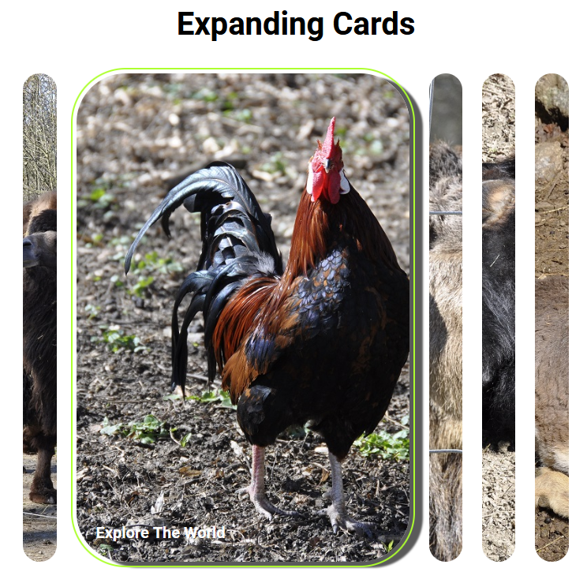

# Welcome to ExpandingCards

## 📋 Features
Dynamic cards: cards expand when clicked or when the user presses the Enter/Space bar.
LocalStorage: The last active map is saved and restored when the page is reloaded.
Accessibility: Integration of aria-expanded and focus control for keyboard users.

## 📸 Preview

## 🔧 Technologies
- HTML5: Structure of the project.
- CSS3: Styling and animations.
- JavaScript: Interactivity and logic.
- LocalStorage: Persistence of user data.

## 🚀 Usage
### 1. Open files
Open the index.html file in any browser.

### 2. Interaction
Click on a card or navigate with Tab and press Enter/Space to zoom in.
Last active card: When the page reloads, the last active map is automatically highlighted.
This project was created to practice the basics of frontend development and to deepen the following skills:

- Event handling in JavaScript.
- CSS animations and transitions.
- Using LocalStorage.
- Responsive design and accessibility.

## 🛠️ Extension ideas

- Loading dynamic content from a JSON array.
- Adding more animation effects.
- Adding additional themes or images.
- API connection for images or content.

## 🤝 Thank you
Feedback is welcome!